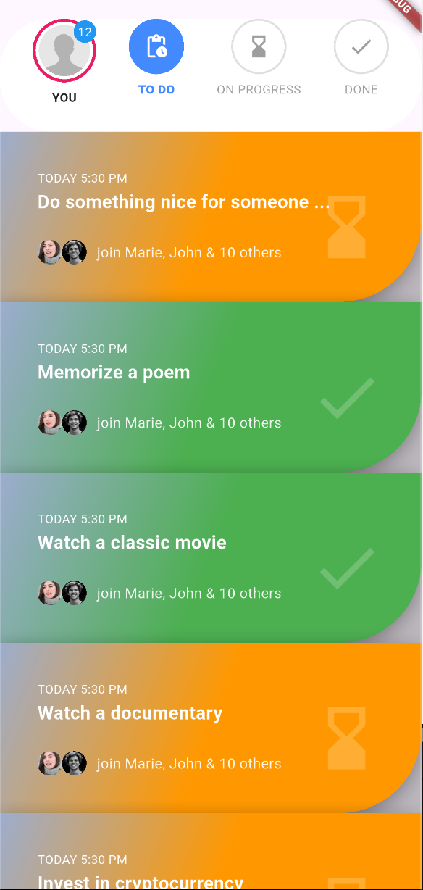

# 📝 To-Do List App  
A clean and simple task management application built with **Flutter + GetX**, supporting API-based To-Do data, status filtering, and task updates.

---


---

## 📚 Table of Contents
- [📌 Deskripsi](#-deskripsi)
- [✨ Fitur Utama](#-fitur-utama)
- [🧩 Teknologi](#-teknologi)
- [📦 API Endpoint](#-api-endpoint)
- [📱 Preview UI](#-preview-ui)
- [🚀 Cara Menjalankan](#-cara-menjalankan)
- [📁 Struktur Folder](#-struktur-folder)
- [🔧 Arsitektur](#-arsitektur)
- [📄 Lisensi](#-lisensi)

---

## 📌 Deskripsi
**To-Do List App** adalah aplikasi manajemen tugas dengan fitur lengkap:
- Menampilkan data To-Do dari API
- Mengubah status tugas (To Do → In Progress → Done)
- Filter tugas berdasarkan status
- Tampilan UI yang modern & responsif
- Menggunakan arsitektur GetX: Controller, Service, View terpisah

Aplikasi ini cocok sebagai contoh integrasi **REST API + GetX** di Flutter.

---

## ✨ Fitur Utama
### ✔ Manage To-Do List
- Ambil data dari API
- Tampilkan To-Do berdasarkan filter:
  - **To Do**
  - **In Progress**
  - **Done**

### ✔ Update Status (PUT / PATCH)
Tugas dapat diubah statusnya menggunakan API.

### ✔ Real-Time UI Update
State otomatis berubah dengan GetX reactive.

### ✔ Dialog Konfirmasi
Saat mengubah status, muncul dialog:

> “Yakin ingin menyelesaikan tugas ini?”

### ✔ Notifikasi Berhasil
Saat tugas selesai → munculkan notifikasi sukses.

---

## 🧩 Teknologi
| Teknologi | Fungsi |
|----------|--------|
| Flutter  | Frontend |
| GetX     | State, Route, Dialog |
| HTTP     | Koneksi API |
| DummyJSON API | Data To-Do sample |

---

## 📦 API Endpoint
Menggunakan API:  
`https://dummyjson.com/todos`

### 🔹 Get All Todos


## 📱 Preview UI



---

## 🚀 Cara Menjalankan

#### 1️⃣ Clone Repo
> git clone https://github.com/psjingga/todo.git
#### 2️⃣ Masuk ke folder proyek:
> cd todo
#### 3️⃣ Install dependencies:
> flutter pub get
#### 4️⃣ Jalankan aplikasi:
> flutter run


## 📁 Struktur Folder


```
lib/
│
├── controllers/
│   └── todo_controller.dart
│
├── services/
│   └── todo_service.dart
│
├── views/
│   ├── home_page.dart
│   ├── todo_list.dart
│   └── widgets/
│       ├── todo_item.dart
│       └── status_menu.dart
│
└── utils/
    └── dialog_helper.dart
```


## 🔧 Arsitektur
- 📌 1. Controller (GetX)
  - Mengatur state + logic:
    - Ambil data API
    - Filter data
    - Update status
- T📌 2. Service
  - HTTP Request:
    - GET data
    - PUT/PATCH update todo
- 📌 3. View (UI)
  - Semua UI menggunakan:
    - Obx untuk reactive
    - ListView untuk list data
    - Widget terpisah agar clean
- 📌 4. Dialog Helper
  - 1 file khusus yang berisi dialog dinamis.

---

## 📄 Lisensi
Aplikasi ini dirilis menggunakan lisensi MIT.
Bebas dipakai, dimodifikasi, dan dikembangkan.

---

⭐ Support
Jika kamu suka dengan proyek ini, klik ⭐ Star di GitHub.